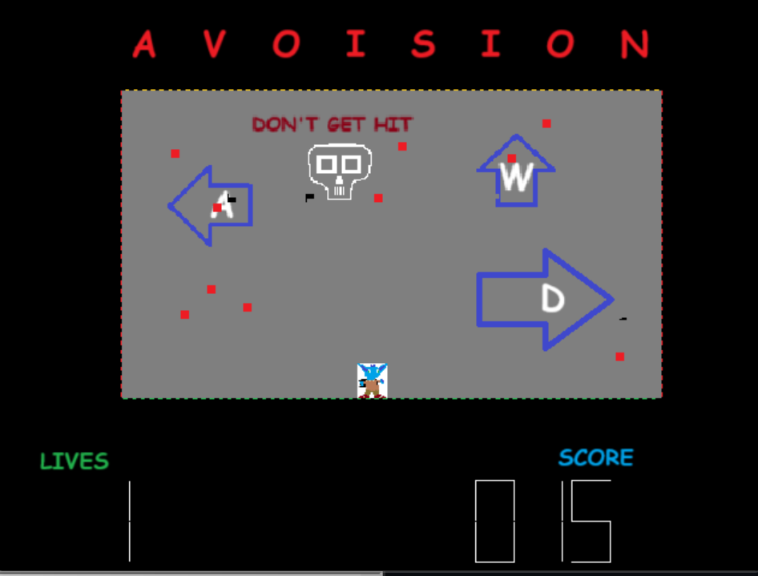

# Avoision

Original bullet-hell game made in 68K Assembly.

## How to Play
 - Download all files and run game.X68 in the [Easy68K Simulator](http://www.easy68k.com/)
 - A to move left, D to move right, and W to jump. Once you lose, press R to restart.

## Key features

## Custom Rendering (bitmap.x68, bitmap32.x68)
 - Optimized rendering of bitmap files to ensure smooth gameplay with a consistent framerate
 - Data processing is frontloaded to preserve cycles
 - Smart redrawing of background preserves performance

## Custom Memory Management (memory.x68)
 - Implemented a custom memory/heap manager to handle memory allocations
 - Used by all core systems

## Fixed-point physics
 - Player and bullet position calculated with fixed point math
 - Physics calculations are made with 12.4 fixed point format

## Object-Oriented Structure
 - Used memory offsets and labels to create an object-oriented structure to manage game objects
 - Function/method calls preserve data using the stack to preserve non-volatile registers

## Randomization
 - Bullets are generated at random each play. No two games will be the same!

## Adaptable Structure
 - Many EQU statements allow for seamless changing of game feel and features
 - Extremely fast iteration during development to tune difficulty and feel

## Seven-Segment Display
 - Custom implementation of seven segment display rendering
 - Max display of 3 digits

This project was conceptualized, planned, and developed in the span of one month using the Easy68k simulator.
